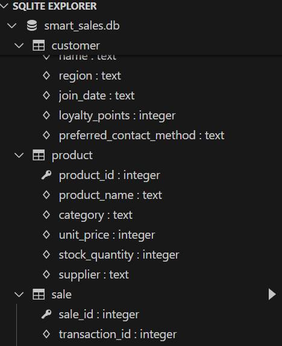
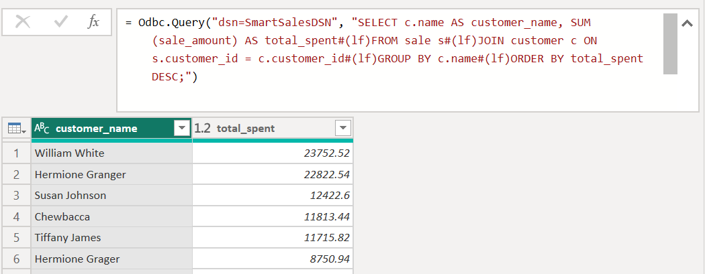
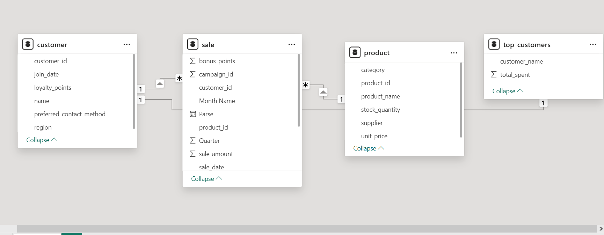
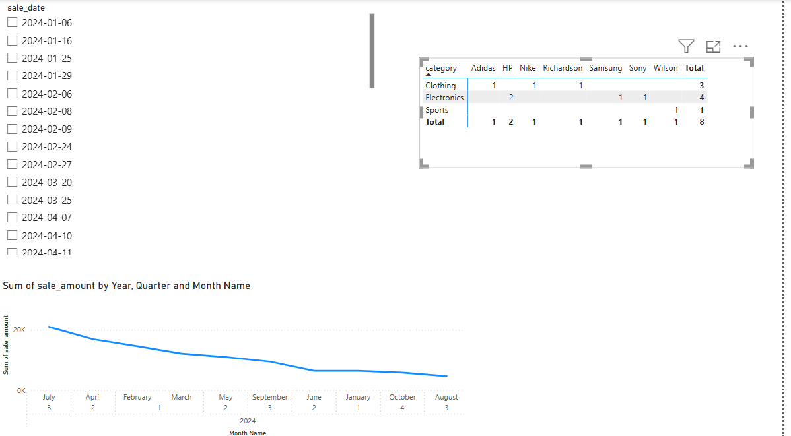
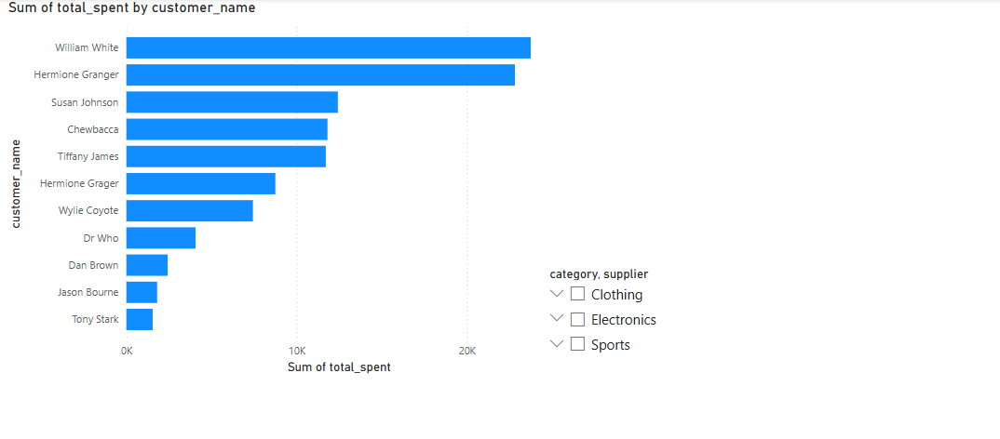
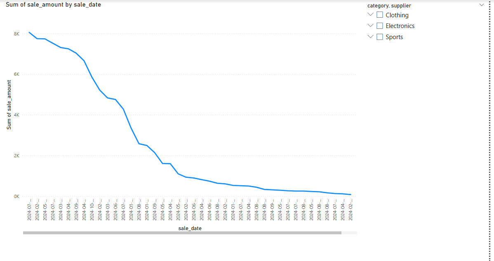
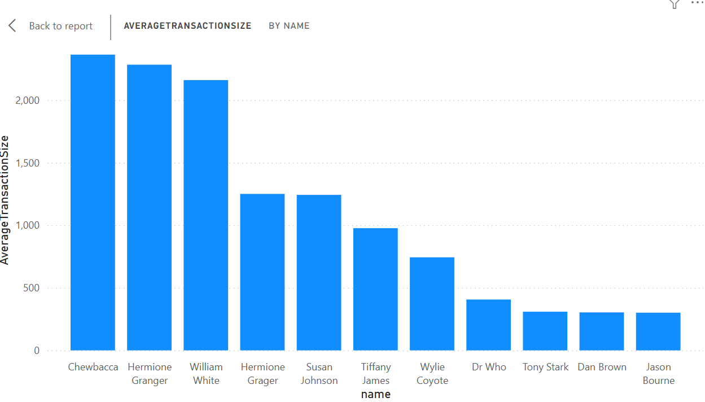
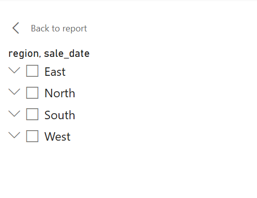
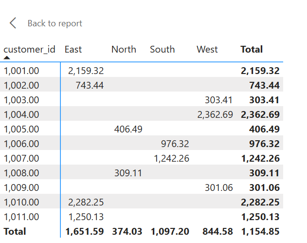
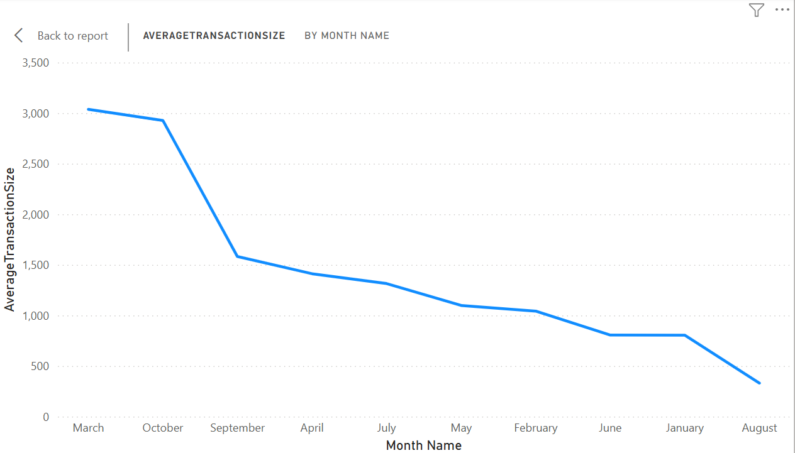

## Create a Repository in GitHub

```
    Name repository     smart-store-yourname.
    Make sure Public is selected.
    Make sure to add README.md (Click the Box)
    Create repository.
---
## Open VS Code

```

    Clone repo using git clone paste url
    Open Root Project Folder
    Make sure Project folder is stored locally (Windows (C:))
    Run all commands from a PowerShell terminal in the root project folder.
---

## Create Folders and Files in Root Project Folder

```
    Commit Push and Pull to main origin using code below
    1. git add .
    2. git clone "urlexample.git"
    3. git commit -m "add .gitignore, cmds to readme"
    4. git push -u origin main
    Run these codes when making any changes to root project folder to ensure push to git on web
---

## Install Packages

```
    source py -m pip install --upgrade -r requirements.txt
---
## Create Folders

```
 data
   - raw
   - prepared
 scripts
 utils
---

## Create scripts data_scrubber.py and data_prep.py

```
    Copy file contents from starter repo provided
---

## Create tests folder and script file test_data_scrubber.py
    Copy file contents from starter repo provided

## Execute test script to confirm data_scrubber.py runs without error

    python tests/test_data_scrubber.py
---
## Create logger.py and data_prep.py
    Create `logger.py` file under utils folder
    Find `logger.py` file in course repo and copy/paste contents into local `logger.py`
    Create `data_prep.py` file under scripts folder
    Find `data_prep.py` file under `smart-sales-starter-files` repo and copy/paste into local `data_prep.py`
    Execute Python script: py scripts\data_prep.py
---
## Data Collection
    -Add to `customers_data.csv`two new columns: LoyaltyPoints and PreferredContactMethod columns
    -Add to `products_data.csv`two new columns: StockQuantity and Supplier columns
    -Add to `sales_data.csv`two new columns: BonusPoints and State
    -Add your own data to all the new columns

## Data Cleaning & Prep
    Create `data_preparation` subfolder in scripts
    Create phyton file for each data table
        -prepare_customers.data.py
        -prepare_products_data.py
        -prepare_sales_data.py
    Copy information from example scripts provided in GitHub
    Create `data_scrubber.py` file in `data_preparation` subfolder
    Create `tests_data_scrubber.py` file in tests folder
    Copy raw file from example GitHub
    Run test script
    python tests\test_data_scrubber.py

## ETL to datawarehouse process
    Desgin schema
    Create one fact (Sale) table and two dimension tables (Customer & Product)
    Each table needs one primary key
    Column names are VERY IMPORTANT. Make sure they match .csv file column names
    Use SQLite to run table query
    script etl_to_dw.py to populate datawarehouse (run file)
    Check for errors

## Data warehouse schema


## Reporting with Power BI
    Load Tables
        Open Power BI Desktop.
        Click Get Data (top left) → Select ODBC from the list.
        Choose the DSN you created in Task 1 (e.g., SmartSalesDSN).
        Click OK. Wait a moment. Power BI will show a list of available tables.
        Select the tables you want to analyze - for most of us: 
        Customer table
        Product table
        Sales table
        Click Load to bring the tables into Power BI.
        Switch to Model view (left panel) to see how the tables are connected.
    SQL Query
        In the Home tab, click Transform Data to open Power Query Editor.
        In Power Query, click Advanced Editor (top menu).
        Delete any code in the editor and replace it with your SQL query (example below). You must use your table names and column names for the SQL to work. 
 
    Power BI Model View

    Charts
 
 
 

## Git Add-Commit-Push
    git add .
    git commit -m "Completed analysis and visualization"
    git push -u origin main
## Module 6
    Section 1. The Business Goal
        Calculate the average transaction size per customer. This helps identify low-value vs high-value customers for upselling and reward strategies.

    Section 2. Data Source
        - **Database**: `smart_sales.db` (SQLite)
        - **Tables Used**: `sales`, `customer`
        - **Columns Used**: 
        - `Customer_ID`
        - `Sale_Amount`
        - `Name`
        - `Region`
        - `Sale_Date`

    Section 3. Tools
        - **Power BI**: For visual OLAP analysis and DAX-based aggregation
        - DAX for creating measures
        - Visuals: bar chart, matrix, slicers

    Section 4. Workflow & Logic
        - Imported SQLite data into Power BI
        - Created measures:
            ```DAX
            TotalSales = SUM(sale[Sale_Amount])
            TransactionCount = COUNT(sale[Sale_ID])
            AverageTransactionSize = DIVIDE([TotalSales], [TransactionCount])

    Section 5. Results
        -Bar Chart: 
 
        -Slicer: 

        -Matrix:
 
        -Line Chart:
 

    Section 6: Suggested Business Action 
        - Send promotions to low-spending customers
        - Create loyalty rewards for high spenders to increase retention
  
    Section 7. Challenges
        - Faced some confusion with creating new measures through DAX. Consulted ChatGPT for help writing new measures and adjusted naming. 

- pip
- loguru
- ipykernel
- jupyterlab
- numpy
- pandas
- matplotlib
- seaborn
- plotly
- pyspark==4.0.0.dev1
- pyspark[sql]
- git+https://github.com/denisecase/datafun-venv-checker.git#egg=datafun_venv_checker
```
